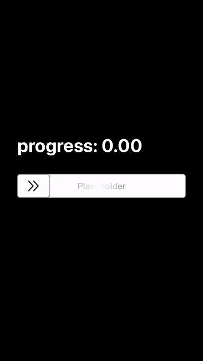

# AJShimmeringSliderView

## Demo



## About The Project

An UIKit shimmering slider view.

### Build With

[Objective-C](https://developer.apple.com/library/archive/documentation/Cocoa/Conceptual/ObjectiveC/Introduction/introObjectiveC.html)

## Getting Started

### Installation

Just copy *AJShimmeringSliderView.h* and *AJShimmeringSliderView.m* to your project.

## Usage

Drag an UIView to xib or storyboard, then assign custom class to AJShimmeringSliderView.

Offering following properties and delegate methods to use:

```objectivec

// ↓↓↓ AJShimmeringSliderViewDelegate ↓↓↓

/// Tells the delegate when the user begin slide view within the receiver.
/// @param sliderView The slider-view object in which the slider began.
- (void)shimmeringSliderViewDidBeginSliding:(AJShimmeringSliderView *)sliderView;

/// Tells the delegate when the user is sliding view within the receiver.
/// @param sliderView The slider-view object in which the slider moved.
- (void)shimmeringSliderViewDidMove:(AJShimmeringSliderView *)sliderView;

/// Tells the delegate when the user is sliding view to end within the receiver.
/// @param sliderView  The slider-view object in which the slider moving ended.
- (void)shimmeringSliderViewDidEndSliding:(AJShimmeringSliderView *)sliderView;

/// Tells the delegate when the slider-view back to start within the receiver.
/// @param sliderView The slider-view object in which the slider backing to start position.
- (void)shimmeringSliderViewDidAutoBounceBackToInitialPosition:(AJShimmeringSliderView *)sliderView;

// ↓↓↓ Properties ↓↓↓

/// The delegate of the slider-view object.
@property (nonatomic, weak) id<AJShimmeringSliderViewDelegate> delegate;

/// Moving progress.
@property (nonatomic, assign) IBInspectable CGFloat progress;

/// Filled in color of the slider-view object.
@property (nonatomic, strong) IBInspectable UIColor *filledInColor;

/// Corner radius of the slider-view object.
@property (nonatomic, assign) IBInspectable CGFloat cornerRadius;

/// Border width of the slider-view object.
@property (nonatomic, assign) IBInspectable CGFloat borderWidth;

/// Border color of the slider-view object.
@property (nonatomic, assign) IBInspectable UIColor *borderColor;

/// Placeholder text of the slider-view object.
@property (nonatomic, strong) IBInspectable NSString *placeholderText;

/// Placeholder text color of the slider-view object.
@property (nonatomic, strong) IBInspectable UIColor *placeholderTextColor;

/// Indicator outline color of the slider-view object.
@property (nonatomic, strong) IBInspectable UIColor *indicatorOutlineColor;

/// Indicator image of the slider-view object.
@property (nonatomic, strong) IBInspectable UIImage *indicatorImage;

/// Whether slider-view object is auto bouncing back.
@property (nonatomic, assign) IBInspectable BOOL isAutoBounceBack;

/// The threshold to full of the slider-view object.
@property (nonatomic, assign) IBInspectable CGFloat fullThreshold;

/// Animation type of the slider-view object.
@property (nonatomic, assign) IBInspectable AJShimmeringSliderViewAnimationType animationType;

```

## License

[WTFPL](http://www.wtfp)
